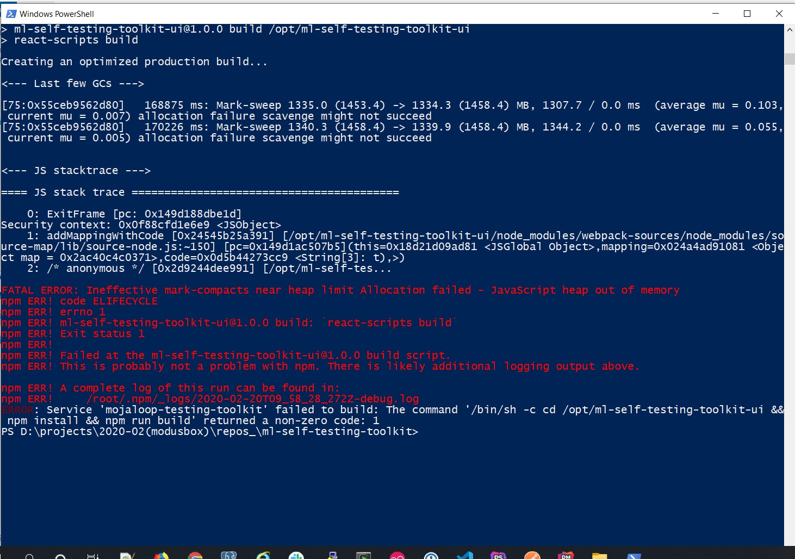
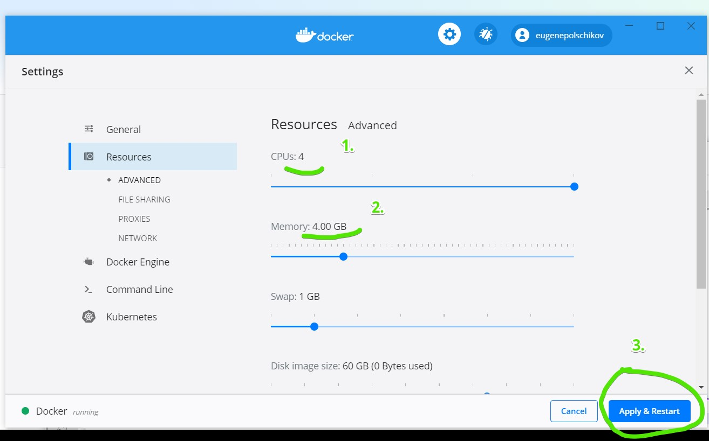
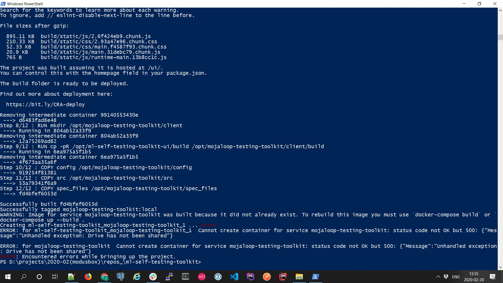
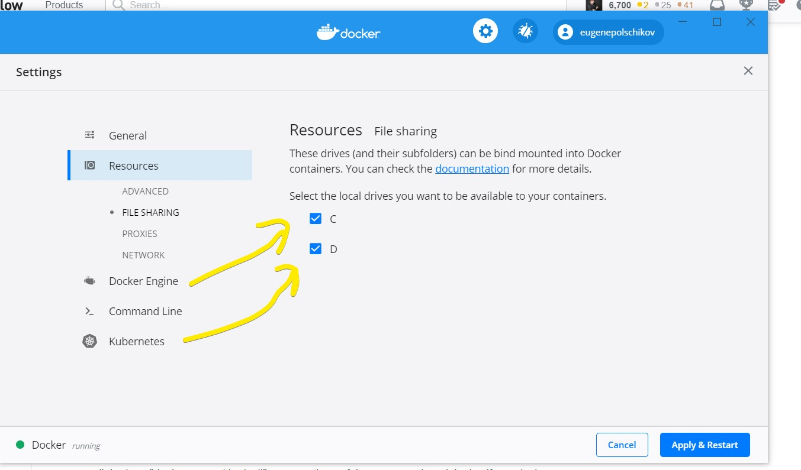

Mojaloop Testing Toolkit
=============================

A testing tool to test the mojaloop implementations.

Table of Contents
=================

- 1. [Quick Start](#1-quick-start)

- 2. [Running the toolkit](#2-running-the-toolkit)

  - 2.1 [With Docker (Preferred way)](#21-with-docker)
	
	- 2.1.1 [Troubleshooting for Windows](#211-troubleshooting-for-windows)

  - 2.2 [Running locally](#22-running-locally)

- 3. [Ports](#3-ports)

- 4. [Testing](#4-testing)

  - 4.1 [With Postman](#41-with-postman)

  - 4.2 [With Mojaloop Simulator](#42-with-mojaloop-simulator)

- 5. [Usgae](#5-usage)

- 6. [Rules Engine](#6-rules)

## 1. Quick Start

For getting started with **Mojaloop Testing Toolkit** quickly please follow the below steps.

* [Deploy Mojaloop Testing Toolkit using docker method](#21-with-docker)
* [Deploy Mojaloop Simulator](#42-with-mojaloop-simulator)
* [Follow Usage guide](/documents/User-Guide.md)


## 2. Running the toolkit

### 2.1 With Docker

This is the easiest way to run the **Mojaloop Testing Toolkit**.

The following softwares should be installed on your system to run the toolkit.

* Git
* Docker

Please execute the following lines to build and run the tool. 

```bash
git clone https://github.com/mojaloop/ml-testing-toolkit
cd ml-testing-toolkit
docker-compose up
```

To update the **Mojaloop Testing Toolkit** to the latest version and rebuild, please run the following

```bash
cd ml-testing-toolkit
git pull
docker-compose build
docker-compose up
```

#### 2.1.1 Troubleshooting for Windows

* Heap out of memory
If face heap error occurs during setup like this: 
  

please open 
> Docker - settings - resources - advanced  

Allocate more resources. As shown in example below: 

  
  
* Drive has not been shared error
If the error with similar stacktrace 
```
ERROR: for mojaloop-testing-toolkit  Cannot create container for service mojaloop-testing-toolkit: status code not OK but 500: {"Message":"Unhandled exception: Drive has not been shared"}
ERROR: Encountered errors while bringing up the project.
```

  
please open 
> Docker - settings - resources - file sharing

and tick those drives where project have been checked out to (cloned to). 
I've  ticked both, as cloned repo is on drive D. 

  


### 2.2 Running locally

The following softwares should be installed on your system to run the toolkit.

* Git
* NodeJS
  
Please execute the following lines to run the testing tool backend service.

```
git clone https://github.com/mojaloop/ml-testing-toolkit.git
cd ml-testing-toolkit
npm install
npm start
```

Please execute the following lines to run the frontend service
```
git clone https://github.com/mojaloop/ml-testing-toolkit-ui.git
cd ml-testing-toolkit-ui
npm install
npm start
```

## 3. Ports

The server will start and listen on port 5000. You can send the mojaloop api requests to this port number.
The test api server will start on port 5050.

And you can get the web interface on http://localhost:6060/

## 4. Testing

### 4.1 With Postman

Once the server is started on a particular port, you can send api requests from the sample postman collection included in this repository to test the basic functionalities like schema validation and version negotiation.

* Install the postman tool
* **postman/mojaloop-pdp-testing-tool.postman_environment.json** - Import this file as environment in postman.
* **postman/mojaloop-pdp-testing-tool.postman_collection.json** - Import this file as a collection in the postman.
* Run this whole collection using the *"Runner"* button at the top.

### 4.2 With Mojaloop Simulator

If you want to test the tool for the whole functionality like schema validation, additional validation and callback generation ..etc, you can initiate a transfer cycle from mojaloop simulator UI.

Please follow the below steps from the ml-testing-toolkit folder

```bash
cd simulator
docker-compose up
```

The above command will start the services scheme-adapter, mojaloop-simulator and mojaloop-simulator-ui.

Open the following URLs in your browser and send a transfer from simulator and observe the toolkit logs in web frontend.

* http://localhost:6060 (Front end for **Mojaloop Testing Toolkit**)
* http://localhost (Front end for **Mojaloop Simulator**)


## 5. Usage

After installation you can follow thsi [Usage Guide](USAGE_GUIDE.md)


## 6. Rules

After you can send a successful transfer from mojaloop simulator, please observe the validation rules and callback generation rules in the front-end.

You can follow the following documentation and change the rules as per your needs.

[Rules Documentation](RULES_ENGINE.md)

****If you have your own DFSP implementation you can point the peer endpoint to **Mojaloop Testing Toolkit** on port 5000 and try to send requests from your implementation instead of using mojaloop-simulator.**
